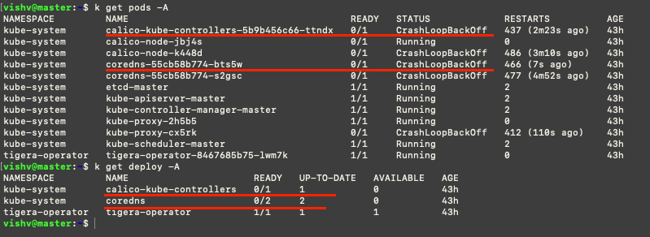
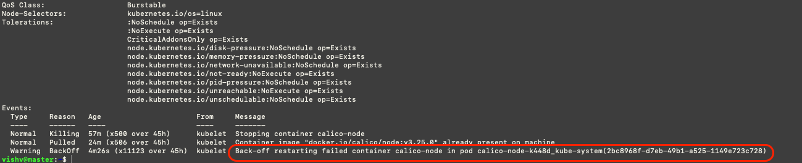
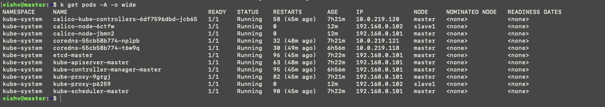

## Steps to Follow

The very first step is to review all the pods and deployment and look for the pods crashlooping.



## Steps to Follow

The very first step is to review all the pods and deployment and look for the pods crashlooping.


# Step-by-Step Troubleshooting Framework
1. #### Why it is failing
    * #### Describe the Pod
    ```bash
     kubectl describe pod -n <name-space> <pod-name>
    ```
    Now go to the event section of the output and look for errors.
    
    

## Whenever specific pods are Crashlooping, areas to look for.

1. If you have checked logs of pods, containers, and describe pods as well. And nothing is substantial. 
### Smoking gun is /etc/containerd/conf.toml file

2. Implement the default conf.toml file 

```bash
 containerd config default | sed 's/SystemdCgroup = false/SystemdCgroup = true/' | sudo tee /etc/containerd/conf.toml
```

3. Reload Daemon

```bash
sudo systemctl daemon-reload
```

4. Restart Kubelet and Containerd 

```bash
sudo systemctl restart kubelet containerd
```


